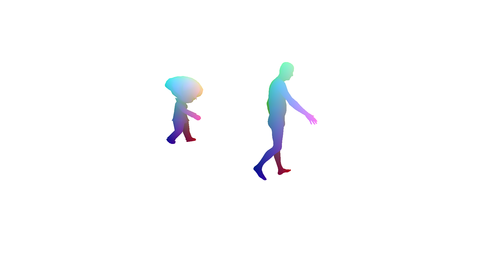

# 三维人体模型之人体姿态迁移 

EE228 课程大作业，利用3D骨架控制3D卡通人物。实验目的：

（1）了解3D视觉中数据表征和3D软件使用、3D人体模型SMPL；

（2）将给定的人体姿态迁移到3D卡通人物上，根据3D动画模型中的关节点定义(joint definition)和 SMPL的关节点定义进行匹配。


# 实验基本原理

常见的3D数据形式: 
（1）fbx (保存了物体顶点，纹理，动力学信息(方便动画制作))；

（2）obj (保存了物体顶点(vertex)的位置信息)；

（3）txt文件标注了3D模型的关节点(joints)名称及坐标。


代码实现：
（1）transfer.py是关节点匹配主函数。其中，每一对配对i:j,表示待匹配模型的关节点i对应给定模型的关节点j，一一对应，至少10个，至多取决于待匹配模型关节点数。

```python
manual_model_to_smpl = {0:0,1:1,2:2,3:3,4:4,5:5,6:6,7:7,8:8,9:9,10:10}
```

（2）vis.py实现可视化，输出匹配结果.pkl，将匹配情况存为图像和mp4。

```python
#transfer_one_frame("samples/Ch14_nonPBR.txt", use_online_model=True)
transfer_one_sequence("fbx/7527.txt", "info_seq_5.pkl", use_online_model=False)
```


# 匹配流程
（1）第一遍可随机匹配关节点（至少10个），运行transfer.py，输出关节点对应名称与序号；

（2）将待匹配模型的关节点与给定模型的关节点一一对应；

（3）再次运行transfer.py，将关节点匹配上；

（4）修改好vis.py结果文件存储路径，运行即可生成匹配.png和.mp4，若图片和视频中两个模型动作一致，则匹配成功。


# 新增脚本说明

vis.py在未完全确认关节点完全匹配正确、模型动作一致时，可以稍作修改，先不生成图像视频，只打开visualizer窗口观察，具体操作即注释掉：

```python
line96 | visualizer.capture_screen_image(vis_save_path, True)
```

便可快速运行vis.py观察匹配是否正确，方便及时纠错，提高效率。若匹配成功需要生成图像视频，取消注释即可。


# 项目结果

待匹配模型以7527.fbx为例：




